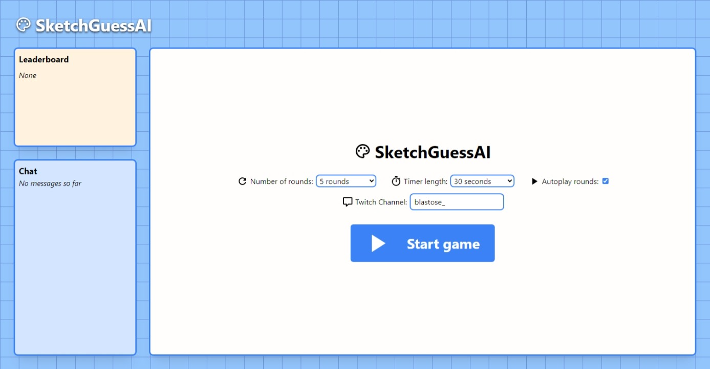
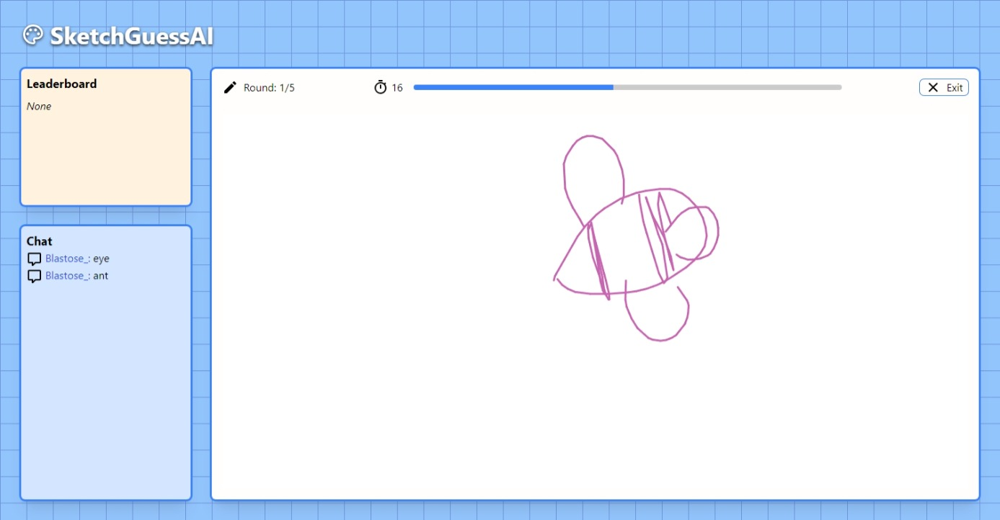
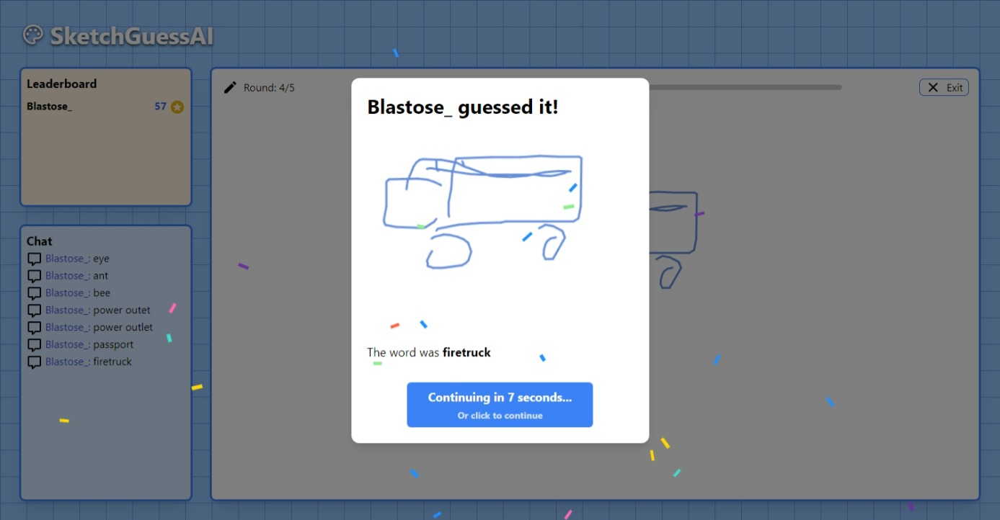
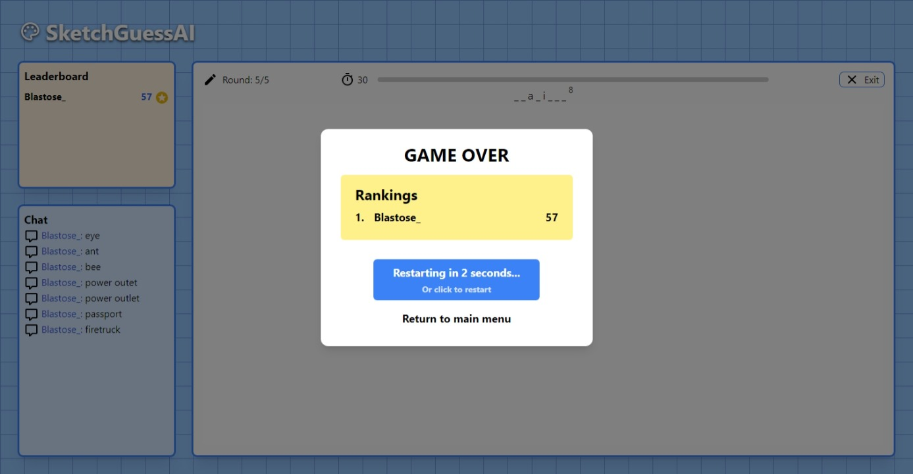

#  SketchGuessAI

SketchGuessAI is a Pictionary-like web game where you guess what an AI is drawing, and earn points based on how fast you can guess correctly.

> ⚠️ The models used to generate the images are about 3mb each, so the project size is about 250~300mb.

You can try out the game at https://sketchguess-ai.pages.dev

To play, type your guess in to the Twitch chat channel you have set, and try to earn the most points!



## Getting Started

### Prerequisites

This project uses npm and pnpm

### Installation

```sh
# Clone the repo
git clone https://github.com/Blastose/sketchguess-ai.git
# Install dependencies
pnpm install
# Launch the dev server
pnpm run dev
```

## Credits

This project uses SketchRNN and magenta.js and their pre-trained models:

- https://magenta.github.io/magenta-js/sketch/
- https://magenta.tensorflow.org/sketch_rnn
- https://github.com/magenta/magenta-demos/blob/main/sketch-rnn-js/README.md

Inspiration from other SketchRNN and magenta.js projects:

- https://magic-sketchpad.glitch.me/
- https://lots-of-sketchrnn-faces.netlify.app/
- https://magenta.tensorflow.org/assets/sketch_rnn_demo/multi_predict.html

Dataset from:

- [Quick, Draw!](https://quickdraw.withgoogle.com/data)

## Game Screenshots





## License

This project is licensed under the [Apache-2.0](LICENSE).
